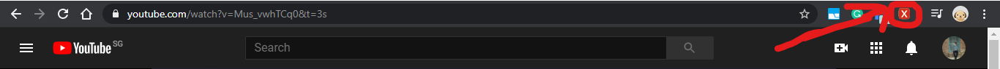
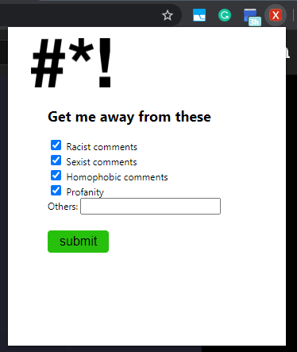
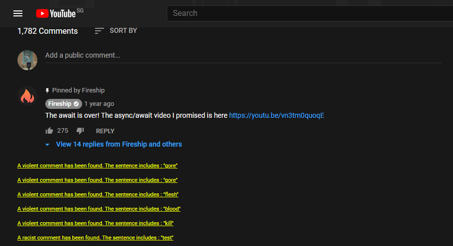

# CensorTube  

## About
CensorTube looks out for racist, homophobic, profanity, sexist and violent words under the Youtube comments section. Then, those comments are removed and replaced in the client side of the webpage (no server is involved). This creates a very safe environment for the user with a very simple chrome extension.

## Personal experience
YouTube is a place for millions of people to share their voices and engage with their communities.
However, it's also a place where people with ill-intentions come to spread hatred and cause depression targeted at various communities. These messages do not provide any constructive feedback but do create tension among the online community.

YouTubers will also feel that those degrading and mentally-harmful comments are targeted at them. The Youtube community will also get affected by these discriminatory comments against them. This chrome extension will be useful to make the Youtube community a more safer place.

## Installation
1. Clone or download this repository into a folder
2. Go to chrome://extensions/
3. Check the box "Developer mode"
4. Click "Load unpacked extension.." and select the folder
5. Run the extension and go on any YouTube video
6. Type "test" and see the extension flag the comment as racist.     

## Built With
- Vanilla Javascript
- HTML/CSS

## Gallery
---

---

---

